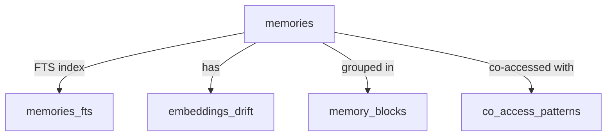

# JAM Memory System - Database Schema Documentation

## Overview
The JAM (Journalistic Agent Memory) system uses SQLite with FTS5 (Full-Text Search) extension for storing and retrieving memories. The database captures structured 5W1H dimensions from all interactions.

## Database File
- **Location**: `./amemory.sqlite3` (configurable via `AM_DB_PATH`)
- **Engine**: SQLite 3.x with FTS5 extension
- **Current Size**: ~5000+ production memories

## Core Tables

### 1. `memories` Table
Primary storage for all memory records with 5W1H decomposition.

```sql
CREATE TABLE memories (
    -- Core Identity
    memory_id TEXT PRIMARY KEY,        -- UUID v4 identifier
    session_id TEXT NOT NULL,           -- Groups related memories
    
    -- 5W1H Dimensions (Core)
    who_id TEXT,                       -- Actor/agent identifier
    what TEXT,                          -- JSON array of entities/concepts
    when_ts TIMESTAMP,                  -- ISO 8601 timestamp
    when_expr TEXT,                     -- Natural language time expression
    where_loc TEXT,                     -- Location/context identifier
    why TEXT,                           -- Purpose/intent
    how TEXT,                           -- Method/process
    
    -- 5W1H List Extensions
    who_list TEXT,                      -- JSON array of all actors involved
    when_list TEXT,                     -- JSON array of temporal expressions
    where_list TEXT,                    -- JSON array of locations
    
    -- Content
    raw_content TEXT,                   -- Original unprocessed content
    summary TEXT,                       -- LLM-generated summary
    
    -- Metadata
    importance REAL DEFAULT 1.0,        -- Relevance score [0-10]
    confidence REAL DEFAULT 1.0,        -- Extraction confidence [0-1]
    created_at TIMESTAMP DEFAULT CURRENT_TIMESTAMP,
    accessed_at TIMESTAMP,
    access_count INTEGER DEFAULT 0,
    
    -- Embeddings
    embedding BLOB,                     -- Vector embedding (binary)
    embed_model TEXT,                   -- Model used for embedding
    embed_dim INTEGER                   -- Embedding dimensions
);

-- Indexes for Performance
CREATE INDEX idx_memories_session ON memories(session_id);
CREATE INDEX idx_memories_who ON memories(who_id);
CREATE INDEX idx_memories_when ON memories(when_ts);
CREATE INDEX idx_memories_created ON memories(created_at);
CREATE INDEX idx_memories_importance ON memories(importance DESC);
```

### 2. `memories_fts` Table
Full-text search virtual table for lexical retrieval.

```sql
CREATE VIRTUAL TABLE memories_fts USING fts5(
    memory_id UNINDEXED,               -- Reference to main table
    content,                            -- Searchable text content
    who,                                -- Searchable actor field
    what,                               -- Searchable entities
    summary                             -- Searchable summary
);
```

### 3. `memory_blocks` Table
Stores pre-computed memory blocks for efficient retrieval.

```sql
CREATE TABLE memory_blocks (
    block_id TEXT PRIMARY KEY,         -- UUID identifier
    query_hash TEXT,                    -- Hash of retrieval query
    member_ids TEXT,                    -- JSON array of memory IDs
    block_content TEXT,                 -- Formatted block text
    token_count INTEGER,                -- Token usage
    created_at TIMESTAMP DEFAULT CURRENT_TIMESTAMP,
    expires_at TIMESTAMP                -- Cache expiration
);

CREATE INDEX idx_blocks_query ON memory_blocks(query_hash);
CREATE INDEX idx_blocks_expires ON memory_blocks(expires_at);
```

### 4. `embeddings_drift` Table
Tracks embedding evolution for adaptive retrieval.

```sql
CREATE TABLE embeddings_drift (
    memory_id TEXT PRIMARY KEY,
    drift_vector BLOB,                  -- Momentum vector
    last_context TEXT,                  -- JSON context snapshot
    updated_at TIMESTAMP DEFAULT CURRENT_TIMESTAMP,
    FOREIGN KEY (memory_id) REFERENCES memories(memory_id)
);
```

### 5. `co_access_patterns` Table
Stores memory co-occurrence patterns for clustering.

```sql
CREATE TABLE co_access_patterns (
    pattern_id INTEGER PRIMARY KEY AUTOINCREMENT,
    memory_id1 TEXT,
    memory_id2 TEXT,
    co_access_count INTEGER DEFAULT 1,
    last_accessed TIMESTAMP DEFAULT CURRENT_TIMESTAMP,
    UNIQUE(memory_id1, memory_id2)
);

CREATE INDEX idx_coaccess_memory1 ON co_access_patterns(memory_id1);
CREATE INDEX idx_coaccess_memory2 ON co_access_patterns(memory_id2);
```

## Data Types & Formats

### JSON Array Fields
The following fields store JSON arrays of extracted items:
- `what`: `["entity1", "entity2", "concept1"]`
- `who_list`: `["user", "assistant", "tool_name"]`
- `when_list`: `["2024-01-15", "yesterday", "3pm"]`
- `where_list`: `["browser", "terminal", "vscode"]`

### Embedding Storage
- **Format**: Binary BLOB (numpy array bytes)
- **Dimensions**: Typically 2048-4096 (model dependent)
- **Normalization**: L2 normalized for cosine similarity

### Timestamp Format
- **when_ts**: ISO 8601 format (`YYYY-MM-DD HH:MM:SS`)
- **created_at/accessed_at**: SQLite CURRENT_TIMESTAMP

## Key Relationships



## Query Patterns

### 1. Hybrid Search (Semantic + Lexical)
```sql
-- Semantic: Use FAISS index with embedding vectors
-- Lexical: FTS5 query
SELECT m.*, 
       snippet(memories_fts, -1, '<b>', '</b>', '...', 32) as snippet
FROM memories m
JOIN memories_fts f ON m.memory_id = f.memory_id
WHERE memories_fts MATCH ?
ORDER BY rank;
```

### 2. Temporal Range Query
```sql
SELECT * FROM memories
WHERE when_ts BETWEEN ? AND ?
  AND session_id = ?
ORDER BY when_ts DESC;
```

### 3. Entity Co-occurrence
```sql
SELECT what, COUNT(*) as frequency
FROM memories
WHERE what IS NOT NULL
  AND created_at > datetime('now', '-30 days')
GROUP BY what
ORDER BY frequency DESC;
```

### 4. Actor-based Retrieval
```sql
SELECT * FROM memories
WHERE who_id = ?
   OR who_list LIKE '%"' || ? || '"%'
ORDER BY importance DESC, created_at DESC;
```

## Migration Notes

### Adding List Columns (Recent Migration)
```sql
-- Safe migration with existence check
ALTER TABLE memories ADD COLUMN who_list TEXT;
ALTER TABLE memories ADD COLUMN when_list TEXT;
ALTER TABLE memories ADD COLUMN where_list TEXT;
```

## Performance Considerations

1. **Index Usage**: All retrieval dimensions have indexes for fast queries
2. **FTS5 Optimization**: Separate virtual table for full-text search
3. **Embedding Storage**: Binary format reduces storage by ~50% vs JSON
4. **Block Caching**: Pre-computed blocks avoid repeated token counting
5. **Batch Operations**: Bulk inserts for multi-part memories

## Configuration

Key database settings (via environment or config):
- `AM_DB_PATH`: Database file location
- `AM_FTS_ENABLED`: Enable/disable FTS5 (default: true)
- `AM_CACHE_BLOCKS`: Cache computed blocks (default: true)
- `AM_VACUUM_ON_START`: Auto-vacuum on startup (default: false)

## Maintenance

### Regular Operations
```sql
-- Vacuum to reclaim space
VACUUM;

-- Analyze for query optimization
ANALYZE;

-- Clear expired blocks
DELETE FROM memory_blocks 
WHERE expires_at < CURRENT_TIMESTAMP;

-- Update access patterns
UPDATE memories 
SET accessed_at = CURRENT_TIMESTAMP,
    access_count = access_count + 1
WHERE memory_id = ?;
```

## Backup Strategy

**CRITICAL**: The database contains production memories and should never be deleted.

```bash
# Backup command
sqlite3 amemory.sqlite3 ".backup backup.db"

# Export to SQL
sqlite3 amemory.sqlite3 .dump > backup.sql

# Verify integrity
sqlite3 amemory.sqlite3 "PRAGMA integrity_check"
```

## Proposed Schema Changes

### Column Consolidation Plan
To simplify the schema and make it consistent with the `what` column pattern, we propose consolidating the WHO, WHEN, and WHERE dimensions to use only JSON array lists, eliminating the redundant singular columns.

#### Current State (Redundant)
```sql
-- Current schema has both singular and list versions
who_id TEXT,                    -- Single actor (deprecated)
who_list TEXT,                  -- JSON array of actors (preferred)

when_ts TIMESTAMP,               -- Single timestamp (deprecated)
when_expr TEXT,                 -- Single expression (deprecated)  
when_list TEXT,                  -- JSON array of temporal expressions (preferred)

where_loc TEXT,                  -- Single location (deprecated)
where_list TEXT,                 -- JSON array of locations (preferred)
```

#### Proposed State (Consolidated)
```sql
-- Simplified schema with only JSON arrays (like 'what' column)
who TEXT,                        -- JSON array of actors ["user", "assistant"]
when TEXT,                       -- JSON array of temporal expressions ["2024-01-15", "3pm"]
where TEXT,                      -- JSON array of locations ["browser", "terminal"]
what TEXT,                       -- JSON array of entities (unchanged)
why TEXT,                        -- Purpose/intent (unchanged)
how TEXT,                        -- Method/process (unchanged)
```

### Migration Strategy

#### Phase 1: Data Migration (Non-destructive)
```sql
-- 1. Populate new columns from existing data
UPDATE memories 
SET who_list = CASE 
    WHEN who_list IS NOT NULL THEN who_list
    WHEN who_id IS NOT NULL THEN json_array(who_id)
    ELSE '[]'
END
WHERE who_list IS NULL;

UPDATE memories
SET when_list = CASE
    WHEN when_list IS NOT NULL THEN when_list
    WHEN when_expr IS NOT NULL THEN json_array(when_expr)
    WHEN when_ts IS NOT NULL THEN json_array(datetime(when_ts))
    ELSE '[]'
END
WHERE when_list IS NULL;

UPDATE memories
SET where_list = CASE
    WHEN where_list IS NOT NULL THEN where_list
    WHEN where_loc IS NOT NULL THEN json_array(where_loc)
    ELSE '[]'
END
WHERE where_list IS NULL;
```

#### Phase 2: Schema Rename (After verification)
```sql
-- 2. Rename list columns to match 'what' pattern
ALTER TABLE memories RENAME COLUMN who_list TO who;
ALTER TABLE memories RENAME COLUMN when_list TO when;
ALTER TABLE memories RENAME COLUMN where_list TO where;

-- 3. Drop deprecated columns (after backup!)
ALTER TABLE memories DROP COLUMN who_id;
ALTER TABLE memories DROP COLUMN when_ts;
ALTER TABLE memories DROP COLUMN when_expr;
ALTER TABLE memories DROP COLUMN where_loc;
```

#### Phase 3: Update Indexes
```sql
-- Drop old indexes
DROP INDEX IF EXISTS idx_memories_who;
DROP INDEX IF EXISTS idx_memories_when;

-- Create new JSON-aware indexes (SQLite 3.38.0+)
CREATE INDEX idx_memories_who_json ON memories(json_extract(who, '$[0]'));
CREATE INDEX idx_memories_when_json ON memories(json_extract(when, '$[0]'));
CREATE INDEX idx_memories_where_json ON memories(json_extract(where, '$[0]'));
```

### Benefits of Consolidation

1. **Consistency**: All 5W1H dimensions use the same JSON array pattern
2. **Flexibility**: Supports multiple values naturally (multiple actors, times, locations)
3. **Simplicity**: Reduces column count from 10 to 6 for 5W1H dimensions
4. **Future-proof**: JSON arrays can evolve to include metadata without schema changes

### Code Changes Required

#### 1. Extraction (`llm_extractor.py`)
```python
# Before
rec.who_id = extracted.get('who')
rec.who_list = json.dumps(extracted.get('who_entities', []))

# After  
rec.who = json.dumps(extracted.get('who_entities', []))
```

#### 2. Retrieval (`retrieval.py`)
```python
# Before
who_match = (m.get('who_id') == query.actor_hint or 
             query.actor_hint in m.get('who_list', '[]'))

# After
who_match = query.actor_hint in json.loads(m.get('who', '[]'))
```

#### 3. Storage (`sql_store.py`)
```python
# Update INSERT/UPDATE statements to use new column names
# Remove references to deprecated columns
```

### Rollback Plan

```sql
-- If issues arise, restore from backup
sqlite3 amemory.sqlite3 ".restore backup.db"

-- Or reverse the migration
ALTER TABLE memories ADD COLUMN who_id TEXT;
ALTER TABLE memories ADD COLUMN when_ts TIMESTAMP;
ALTER TABLE memories ADD COLUMN when_expr TEXT;
ALTER TABLE memories ADD COLUMN where_loc TEXT;

-- Restore data from JSON arrays
UPDATE memories SET who_id = json_extract(who, '$[0]');
UPDATE memories SET when_ts = json_extract(when, '$[0]');
UPDATE memories SET where_loc = json_extract(where, '$[0]');
```

### Timeline

1. **Week 1**: Backup and data migration to list columns
2. **Week 2**: Update application code to use list columns exclusively
3. **Week 3**: Monitor for issues, verify data integrity
4. **Week 4**: Execute schema rename and column drops
5. **Week 5**: Update indexes and optimize queries

### Compatibility Notes

- **Backward Compatibility**: Keep reading from both old and new columns during transition
- **API Compatibility**: Maintain same API responses by adapting at service layer
- **Query Compatibility**: Update all SQL queries to use JSON functions
- **FTS Compatibility**: Update FTS5 table to index JSON arrays properly

## Table Cleanup Plan

### Tables to Drop

After careful analysis, the following tables can be safely removed as they are either deprecated, unused, or their functionality has been superseded:

#### 1. `memory_blocks` Table
**Reason**: Block building is now done dynamically with token budgets rather than pre-cached.
```sql
-- Backup data first (if needed)
SELECT * FROM memory_blocks INTO OUTFILE 'memory_blocks_backup.json';

-- Drop the table
DROP TABLE IF EXISTS memory_blocks;

-- Also drop related indexes
DROP INDEX IF EXISTS idx_blocks_query;
DROP INDEX IF EXISTS idx_blocks_expires;
```

#### 2. `embeddings_drift` Table  
**Reason**: Embedding drift tracking was experimental and is now handled in-memory during retrieval sessions.
```sql
-- Backup drift data
SELECT * FROM embeddings_drift INTO OUTFILE 'embeddings_drift_backup.json';

-- Drop the table
DROP TABLE IF EXISTS embeddings_drift;
```

#### 3. `co_access_patterns` Table
**Reason**: Co-access patterns are now computed dynamically from the network analytics rather than stored.
```sql
-- Backup pattern data
SELECT * FROM co_access_patterns INTO OUTFILE 'co_access_patterns_backup.json';

-- Drop the table
DROP TABLE IF EXISTS co_access_patterns;

-- Drop related indexes
DROP INDEX IF EXISTS idx_coaccess_memory1;
DROP INDEX IF EXISTS idx_coaccess_memory2;
```

### Final Simplified Schema

After consolidation and cleanup, the database will have only 2 tables:

```sql
-- Primary table with consolidated 5W1H columns
CREATE TABLE memories (
    memory_id TEXT PRIMARY KEY,
    session_id TEXT NOT NULL,
    
    -- 5W1H Dimensions (all JSON arrays)
    who TEXT,                       -- JSON array
    what TEXT,                      -- JSON array
    when TEXT,                      -- JSON array
    where TEXT,                     -- JSON array
    why TEXT,                       -- Plain text
    how TEXT,                       -- Plain text
    
    -- Content
    raw_content TEXT,
    summary TEXT,
    
    -- Metadata
    importance REAL DEFAULT 1.0,
    confidence REAL DEFAULT 1.0,
    created_at TIMESTAMP DEFAULT CURRENT_TIMESTAMP,
    accessed_at TIMESTAMP,
    access_count INTEGER DEFAULT 0,
    
    -- Embeddings
    embedding BLOB,
    embed_model TEXT,
    embed_dim INTEGER
);

-- FTS5 virtual table for full-text search
CREATE VIRTUAL TABLE memories_fts USING fts5(
    memory_id UNINDEXED,
    content,
    who,
    what,
    when,
    where,
    summary
);
```

### Cleanup Benefits

1. **Reduced Complexity**: From 5 tables to 2 tables
2. **Lower Storage**: Removes redundant cached data
3. **Simpler Maintenance**: Fewer indexes to maintain
4. **Better Performance**: Less overhead from unused tables
5. **Cleaner Backups**: Smaller, focused backup files

### Pre-Cleanup Checklist

```bash
# 1. Full backup before cleanup
sqlite3 amemory.sqlite3 ".backup pre_cleanup_backup.db"

# 2. Export each table to JSON (for selective recovery)
sqlite3 amemory.sqlite3 <<EOF
.mode json
.output memory_blocks.json
SELECT * FROM memory_blocks;
.output embeddings_drift.json  
SELECT * FROM embeddings_drift;
.output co_access_patterns.json
SELECT * FROM co_access_patterns;
.output stdout
EOF

# 3. Verify no foreign key dependencies
sqlite3 amemory.sqlite3 "PRAGMA foreign_key_check;"

# 4. Check table sizes before dropping
sqlite3 amemory.sqlite3 <<EOF
SELECT name, 
       COUNT(*) as row_count,
       SUM(length(sql)) as approx_size
FROM sqlite_master 
LEFT JOIN (SELECT * FROM memory_blocks) ON 1=1
WHERE type='table' 
GROUP BY name;
EOF
```

### Post-Cleanup Optimization

```sql
-- After dropping tables, optimize the database
VACUUM;
ANALYZE;
PRAGMA optimize;

-- Verify final schema
SELECT name, type FROM sqlite_master WHERE type IN ('table', 'index');
```

### Emergency Recovery

If any issues arise after cleanup:

```bash
# Restore entire database from backup
sqlite3 amemory.sqlite3 ".restore pre_cleanup_backup.db"

# Or selectively recreate a dropped table
sqlite3 amemory.sqlite3 <<EOF
CREATE TABLE memory_blocks (
    block_id TEXT PRIMARY KEY,
    query_hash TEXT,
    member_ids TEXT,
    block_content TEXT,
    token_count INTEGER,
    created_at TIMESTAMP DEFAULT CURRENT_TIMESTAMP,
    expires_at TIMESTAMP
);
.read memory_blocks.json
EOF
```