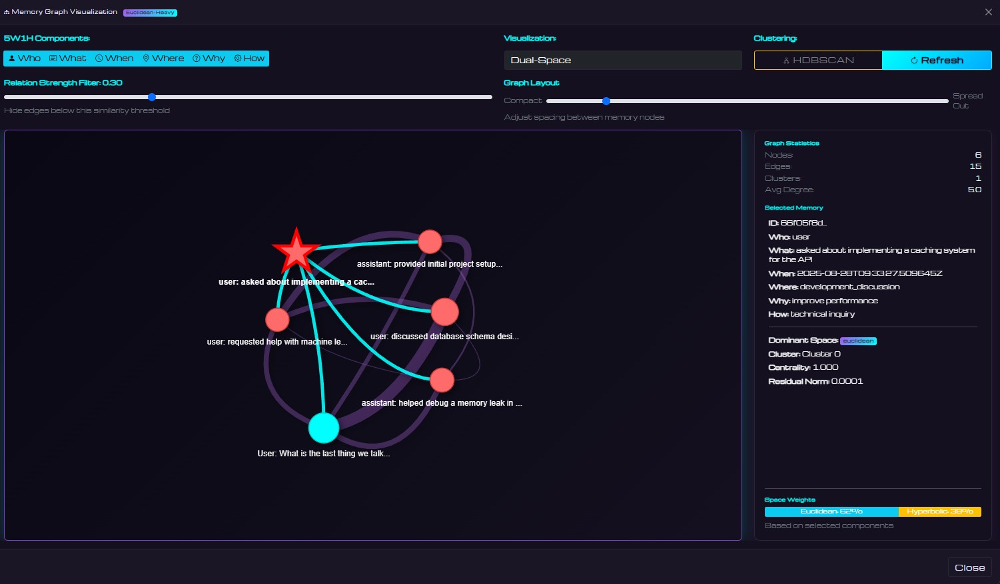

# [DSAM] Dual-Space Agentic Memory

DSAM is an adaptive geometric memory system for AI agents featuring dual-space encoding (Euclidean + Hyperbolic), adaptive residual learning, provenance tracking, and dynamic visualization.

## Overview

DSAM is a content-addressable memory system that operates on dual geometric manifolds. Unlike traditional memory systems that require explicit addresses, DSAM retrieves memories based on semantic similarity of their content. The architecture combines Euclidean space for concrete/lexical similarity with Hyperbolic space for abstract/hierarchical relationships, featuring immutable anchor embeddings with bounded residual adaptation that enable memories to evolve while maintaining stable representations.



## Core Architecture

### Dual-Space Encoding
- **Euclidean Space** (768-dim): Direct semantic embeddings from all-mpnet-base-v2 for concrete information
- **Hyperbolic Space** (64-dim): Models hierarchical relationships using Poincaré ball geometry with numerical stability
- **Field-Aware Composition**: Learned gates weight contributions from 5W1H fields
- **Product Distance Metrics**: Query-dependent weighting between spaces (λ_E + λ_H = 1.0)
- **Enhanced Base Model**: Using sentence-transformers/all-mpnet-base-v2 for superior semantic understanding

### Content-Addressable Memory
- **Semantic Retrieval**: Query with partial content, retrieve by meaning not location
- **Dual-Space Matching**: Content similarity computed in both Euclidean and Hyperbolic spaces
- **Structured Queries**: Use any combination of 5W1H fields for precise content matching
- **No Explicit Addresses**: Memories accessed purely through content similarity
- **Adaptive Similarity**: Frequently co-retrieved memories gravitate together in embedding space

### Adaptive Memory
- **Immutable Anchors**: Base embeddings preserved without corruption
- **Scale-Aware Residual Bounds**: Dynamic bounds based on anchor norms (Euclidean ≤ 0.35, Hyperbolic ≤ 0.75)
- **Field-Level Adaptation Limits**: Configurable per-field limits (e.g., 'who' limited to 0.2)
- **Momentum-Based Updates**: Smooth adaptation with configurable momentum (0.9) and decay factor (0.995)
- **HDBSCAN Clustering**: Density-based clustering with configurable parameters (min_cluster_size, min_samples)
- **Provenance Tracking**: Version history, residual norms, co-retrieval partners, and access patterns

### 5W1H Journal Framework
Complete context encoding for each memory:
- **Who**: Entity or actor involved
- **What**: Action, observation, or content
- **When**: Temporal information
- **Where**: Location or context
- **Why**: Purpose, reasoning, or intent
- **How**: Method, approach, or process

## Installation

```bash
# Clone repository
git clone <repository-url>
cd agent-wip

# Install dependencies
pip install -r requirements.txt

# For offline mode (recommended)
export HF_HUB_OFFLINE=1
export TRANSFORMERS_OFFLINE=1
```

## Quick Start

### Command Line Interface

```bash
# Initialize memory system
python cli.py init

# Store memories (no address needed - content is the key)
python cli.py remember --who "Alice" --what "implemented search feature" --where "backend" --why "user requirement" --how "elasticsearch integration"

# Content-addressable recall - query by partial content
python cli.py recall --what "search" --k 10  # Finds memories semantically similar to "search"
python cli.py recall --who "Alice" --what "feature" --k 5  # Multi-field content matching
python cli.py recall --why "optimization" --k 10  # Abstract concept retrieval

# View statistics
python cli.py stats

# Save/Load state
python cli.py save
python cli.py load
```

### Web Interface

```bash
# Launch enhanced web interface
python run_web.py

# Access at http://localhost:5000
```

The web interface provides:
- Interactive chat with real-time space weight visualization
- Memory management with full 5W1H display
- Graph visualization with configurable HDBSCAN parameters
- Analytics dashboard with residual tracking
- Provenance information for each memory

### Generate Dataset
- Iterative script generating memory events using two-way LLM calls

```bash
# Run conversation simulations
python simulate_conversations.py
```

## Web Interface Features

### Chat Interface
- Real-time space weight visualization (Euclidean vs Hyperbolic)
- Query type detection (concrete/abstract/balanced)
- Memory usage indicators with provenance data
- Context-aware responses

### Memory Management
- Full 5W1H field display with all metadata
- Provenance tracking (version, access count, co-retrieval partners)
- Residual norm visualization
- Field-specific adaptation limits
- Space dominance indicators
- Residual norm visualization
- Individual memory graph view
- Batch operations support

### Graph Visualization
- **Interactive Network Graph**: Powered by vis.js
- **5W1H Component Selection**: Choose which fields to visualize
- **Multiple Visualization Modes**:
  - Dual-space view
  - Euclidean-only
  - Hyperbolic-only
  - Residual magnitude
- **HDBSCAN Clustering**: Configurable clustering with adjustable parameters
  - Min cluster size (2-20)
  - Min samples (1-10)
  - Real-time parameter adjustment
- **Individual Memory Focus**: View a memory and its related connections
- **Graph Statistics**: Nodes, edges, clusters, average degree

### Analytics Dashboard
- Total events and queries metrics
- Average residual norms by space
- Residual evolution time series
- Space usage distribution chart
- Real-time updates

## API Endpoints

### Core Endpoints
- `POST /api/chat`: Send chat messages with space weight calculation
- `GET /api/memories`: Retrieve all memories with metadata
- `POST /api/memories`: Create new memory
- `DELETE /api/memories/<id>`: Delete specific memory
- `POST /api/graph`: Get memory graph data with optional center node
- `POST /api/search`: Search memories by query
- `GET /api/stats`: Get system statistics
- `GET /api/analytics`: Get analytics data for charts

## System Architecture

### Memory Store (`memory/memory_store.py`)
- Dual-space encoding integration
- Residual and momentum tracking with scale-aware bounds
- HDBSCAN clustering with configurable parameters
- Field-level adaptation limits
- Forgetting mechanism for drift hygiene
- ChromaDB backend interface

### Dual-Space Encoder (`memory/dual_space_encoder.py`)
- Sentence transformer for base embeddings (all-mpnet-base-v2)
- Hyperbolic operations with numerical stability
  - Norm clipping to prevent boundary issues
  - Safe exp/log maps with epsilon stabilization
  - Möbius addition with automatic retraction
- Field-aware gating mechanism
- Query weight computation (λ_E, λ_H)

### ChromaDB Storage (`memory/chromadb_store.py`)
- Persistent vector storage
- Full 5W1H metadata preservation
- Provenance tracking (version, residual norms, co-retrieval partners)
- Efficient similarity search
- Unlimited capacity scaling

## Content-Addressable Memory in Action

### How It Works
```python
# Store memories without addresses - content IS the address
memory_agent.remember(
    who="Alice",
    what="implemented caching system",
    how="Redis with LRU eviction"
)

# Retrieve by partial content - no memory ID needed
results = memory_agent.recall(
    what="caching",  # Partial content match
    k=5
)
# Returns memories semantically similar to "caching"

# Multi-field content queries
results = memory_agent.recall(
    who="Alice",
    what="system",
    k=10
)
# Finds memories matching both fields semantically
```

### Content Addressing Features
- **No Memory IDs**: Content embeddings serve as implicit addresses
- **Semantic Matching**: Retrieves based on meaning, not exact string match
- **Partial Recall**: Query with fragments, retrieve complete memories
- **Cross-Field Search**: Any combination of 5W1H fields acts as content key
- **Similarity Ranking**: Results ordered by semantic distance in dual-space

## Key Innovations

### Enhanced Content-Addressable Architecture
DSAM extends traditional content-addressable memory with geometric intelligence:
- **Dual-Manifold Content Matching**: Simultaneous similarity search in Euclidean and Hyperbolic spaces
- **Semantic Address-Free Retrieval**: No memory pointers or indices - pure content-based access
- **Partial Content Queries**: Retrieve complete memories from fragments of information
- **Compositional Content Addressing**: Combine multiple 5W1H fields for precise matching

### Query-Adaptive Retrieval
- Dynamic space weighting based on query content type
- Concrete queries (code, errors) favor Euclidean space for lexical similarity
- Abstract queries (concepts, philosophy) favor Hyperbolic space for hierarchical relationships
- Balanced queries use both spaces equally
- Content determines retrieval geometry automatically

### Residual Adaptation
- Memories adapt based on co-retrieval patterns
- Bounded updates prevent representation drift
- Momentum smoothing for stable learning
- Automatic decay over time

### Visual Analytics
- Space usage indicators throughout UI
- Real-time residual tracking
- Interactive graph exploration
- Component-based filtering

## Configuration

Key settings in `config.py`:

```python
MemoryConfig:
  embedding_dim: 768  # Legacy dimension (kept for compatibility)
  temperature: 15.0
  similarity_threshold: 0.85

DualSpaceConfig:
  euclidean_dim: 768  # Dimension for Euclidean space
  hyperbolic_dim: 64  # Dimension for hyperbolic space
  learning_rate: 0.01
  momentum: 0.9
  euclidean_bound: 0.35  # Max residual norm for Euclidean
  hyperbolic_bound: 0.75  # Max residual norm for Hyperbolic
  use_relative_bounds: true  # Scale-aware bounds
  max_norm: 0.999  # Maximum norm in Poincaré ball
  epsilon: 1e-5  # Numerical stability epsilon
  decay_factor: 0.995
  min_residual_norm: 1e-6  # Minimum before zeroing
  hdbscan_min_cluster_size: 5
  hdbscan_min_samples: 3
  field_adaptation_limits:  # Per-field limits
    who: 0.2
    when: 0.3
    what: 0.5
    where: 0.4
    why: 0.5
    how: 0.5
  enable_forgetting: true

StorageConfig:
  chromadb_path: "./state/chromadb"
  chromadb_required: true
```

## Performance Characteristics

- **Graph Visualization**: Optimized for up to 200 nodes
- **HDBSCAN Clustering**: Best with 20+ memories, configurable parameters
- **Real-time Updates**: Sub-second for < 1000 memories
- **Residual Bounds**: Scale-aware with configurable limits
- **Hyperbolic Stability**: Automatic norm clipping at 0.999
- **Provenance Tracking**: Maintains full history without performance impact

## Troubleshooting

### Common Issues

**HuggingFace Rate Limiting**
```bash
export HF_HUB_OFFLINE=1
export TRANSFORMERS_OFFLINE=1
```

**ChromaDB Locked**
```bash
# Stop web server before clearing
python clear_memories.py
```

**High Residuals**
- System automatically decays residuals (factor 0.995)
- Monitor via Analytics dashboard
- Field-level limits prevent excessive adaptation
- Use forgetting mechanism to reset specific memories
- Consider clearing if consistently > bounds

## Development

### Testing
```bash
# Test dual-space memory
python tests/test_dual_space.py

# Test full model
python test/test_model.py

# Test api
python tests/test_api.py


```

### Adding New Features
1. Extend memory operations in `memory_agent.py`
2. Add API endpoints in `web_app.py`
3. Update frontend in `static/js/app.js`
4. Document in relevant markdown files

## License

[MIT License](LICENSE)
