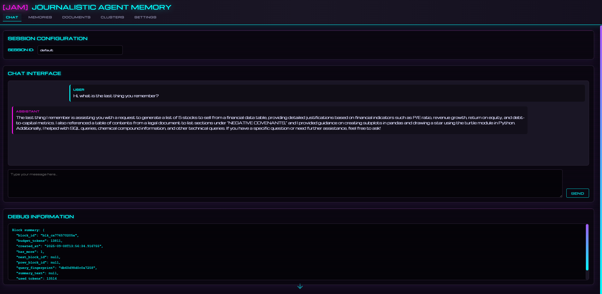

# JAM - Journalistic Agent Memory
> [!CAUTION]
> JAM is currently in pre-release and some functionality may be broken.

> Give your AI assistant a memory that actually remembers

JAM is a local-first memory system that gives AI assistants human-like memory capabilities. Every conversation, tool use, and interaction becomes a searchable memory that your AI can recall and build upon. Think of it as giving your AI assistant a journal that it actually reads and learns from.

JAM features:
- **Persistent Memory**: Your AI remembers past conversations, decisions, and context across sessions
- **Smart Recall**: Finds relevant memories using multiple strategies - not just keyword matching
- **Self-Organization**: Memories naturally cluster by topic, time, and importance
- **Tool Memory**: Learns from past web searches, API calls, and tool usage

## Quick Start

### Prerequisites

#### System Requirements
- Python 3.11 or newer
- 8GB+ RAM recommended (16GB+ for larger models)
- 10GB+ free disk space

#### External Dependencies

##### llama.cpp Server (Required)
JAM requires llama.cpp to be installed and accessible on your system. The `llama_server_manager.py` script will automatically start and manage the llama.cpp server instances.

**Installation Options:**

1. **Pre-built Binary (Recommended for most users)**
   - Download from: https://github.com/ggerganov/llama.cpp/releases
   - Choose the appropriate binary for your platform (Windows, macOS, Linux)
   - Extract and add to your system PATH, or note the full path to `llama-server` executable

2. **Build from Source**
   ```bash
   git clone https://github.com/ggerganov/llama.cpp
   cd llama.cpp
   make  # On Linux/macOS
   # Or for Windows, use cmake or follow the project's build instructions
   ```

3. **Verify Installation**
   ```bash
   # The llama-server executable should be accessible
   llama-server --version
   # Or specify full path if not in PATH
   /path/to/llama-server --version
   ```

If llama.cpp is not in your PATH, you can configure the path in your `.env` file:
```bash
LLAMA_CPP_PATH=/path/to/llama-server
```

##### LLM Model File (Required)
- Download a GGUF format model (we recommend Qwen2.5-3B or Qwen2.5-7B)
- Download from: https://huggingface.co/models?search=qwen+gguf
- Place the model file in an accessible location
- Configure the path in your `.env` file or via the web interface

### Installation

```bash
# Clone the repository
git clone https://github.com/jwest33/jam_model_memory.git
cd jam_model_memory

# Create and activate virtual environment (recommended)
python -m venv .venv
# On Windows PowerShell:
.\.venv\Scripts\Activate.ps1
# On Windows Command Prompt:
.venv\Scripts\activate.bat
# On Linux/macOS:
source .venv/bin/activate

# Install Python dependencies
pip install -r requirements.txt

# Optional: Install document parsing dependencies
pip install -r requirements-optional.txt

# Configure your model path (create .env file)
echo "AM_MODEL_PATH=/path/to/your/model.gguf" > .env

# Start llama.cpp servers
# This will use the llama-server executable from your PATH or configured location
python llama_server_manager.py both start

# Start web interface
python run_web.py

# Open the web interface
# Navigate to: http://localhost:5001
```

**First Run Checklist:**
1. llama.cpp installed and accessible
2. GGUF model downloaded and path configured
3. Python dependencies installed
4. Servers started successfully
5. Web interface accessible at http://localhost:5001

If any server fails to start, check:
- Is llama-server in your PATH or LLAMA_CPP_PATH configured?
- Is your model path correct in .env or config?
- Are ports 8000, 8001, and 5001 available?

## Screenshots

### Chat Interface
The main interface where you interact with your AI assistant where it can recall relevant past conversations and build on previous context:



### Memory Explorer
Browse through all stored memories, see how they're categorized, and understand what your AI remembers:


### Settings Panel
Configure how your AI's memory works - adjust search strategies, memory retention, and more:


### Memory Visualization
Watch your AI's memory organize itself in real-time with our 3D cluster visualization:


## How It Works

JAM uses a journalistic approach to memory - every event is broken down into the fundamental questions: Who, What, When, Where, Why, and How. This allows the AI to:

1. **Understand Context**: "Who was involved in that conversation about the budget last Tuesday?"
2. **Track Patterns**: "What approaches have we tried for this problem before?"
3. **Learn from Experience**: "How did we solve this issue last time?"
4. **Maintain Continuity**: "Why did we decide to go with that approach?"

### The Magic Behind the Scenes

When you interact with JAM:

1. **Capture**: Every message, response, and tool use is captured
2. **Extract**: A local AI extracts the key information (Who, What, When, Where, Why, How)
3. **Index**: The memory is stored and indexed for fast retrieval
4. **Retrieve**: When needed, relevant memories are found using multiple search strategies
5. **Apply**: The AI uses these memories to provide context-aware responses

## Configuration

JAM works out of the box with sensible defaults, but you can customize it through:

### Web Interface
Visit `http://localhost:5001/config` to adjust settings in real-time

### Environment Variables
Create a `.env` file for persistent configuration:

```bash
# Essential Settings
AM_MODEL_PATH=/path/to/your/model.gguf  # Path to your LLM model
AM_DB_PATH=./memories.db                # Where to store memories

# Optional Tuning
AM_CONTEXT_WINDOW=8192                  # How much context the AI can use
AM_USE_LIQUID_CLUSTERS=true            # Enable self-organizing memory
AM_USE_ATTENTION=true                   # Track which memories are used
```

## Advanced Features

### Command Line Interface
Control everything from the terminal:

```bash
# Server management
python -m agentic_memory.cli server status     # Check what's running
python -m agentic_memory.cli server restart    # Restart all services

# Memory operations
python -m agentic_memory.cli memory add "Remember this important note"
python -m agentic_memory.cli memory search "that meeting last week"
python -m agentic_memory.cli memory stats      # See memory statistics
```

### API Access
JAM provides an OpenAI-compatible API for integration with other tools:

```python
import requests

response = requests.post("http://localhost:8001/v1/chat/completions",
    json={
        "messages": [{"role": "user", "content": "What did we discuss yesterday?"}],
        "model": "local"
    }
)
```

### Memory Visualization
The 3D visualization shows how memories cluster and relate:
- **Clusters**: Similar memories group together automatically
- **Colors**: Indicate recency, usage frequency, or topic
- **Movement**: Watch memories reorganize as you use them
- **Exploration**: Click and drag to explore your memory landscape

## Features

### Smart Memory Retrieval
- **Semantic Search**: Finds memories by meaning, not just keywords
- **Temporal Awareness**: Prioritizes recent and relevant memories
- **Pattern Recognition**: Identifies related memories across time
- **Context Building**: Optimally packs memories for AI context windows

### Privacy & Control
- **100% Local**: Everything runs on your computer
- **No Cloud Dependencies**: Your data never leaves your machine
- **Export/Import**: Take your memories with you
- **Selective Forgetting**: Remove memories you don't want kept

### Tool Integration
JAM remembers and learns from tool usage:


- Web searches and their results
- API calls and responses
- File operations and outcomes
- Custom tool executions

## Contributing

We welcome contributions! Whether it's bug fixes, new features, or documentation improvements, please feel free to:

1. Fork the repository
2. Create a feature branch
3. Make your changes
4. Submit a pull request

## License

MIT License - see [LICENSE](LICENSE) for details

## Acknowledgments

- [llama.cpp](https://github.com/ggerganov/llama.cpp) for local LLM inference
- [FAISS](https://github.com/facebookresearch/faiss) for vector similarity search
- [Qwen3](https://qwen.readthedocs.io/en/latest/) for providing an awesome family of models

---

*For technical details and architecture information, see [docs/TECHNICAL.md](docs/TECHNICAL.md)*
