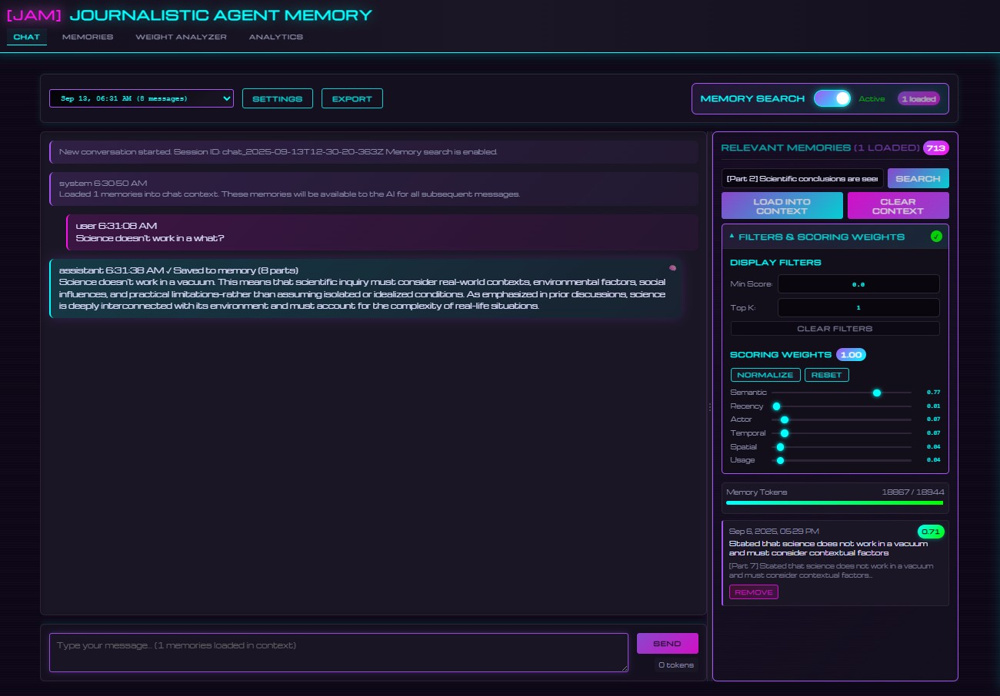

# JAM (Journalistic Agent Memory)

A local-first memory system for LLM agents that provides persistent, searchable memory using journalistic 5W1H (Who, What, When, Where, Why, How) semantic extraction. Every conversation, tool use, and interaction becomes a searchable memory that the AI can recall and build upon.

## Application Overview

JAM transforms AI interactions into structured, queryable memories using journalistic principles. The system runs entirely locally using llama.cpp and provides a web interface.



### Key Features

- **5W1H Memory Extraction**: Automatically decomposes events into journalistic dimensions (Who, What, When, Where, Why, How)
- **Hybrid Retrieval**: Combines 6 retrieval strategies for optimal memory recall
- **Local-First Architecture**: Complete privacy with all processing on your machine
- **Token-Optimized Selection**: Smart memory retrieval using knapsack algorithm
- **Chat Interface**: Interactive AI assistant with full memory context
- **Web Interface**: Synthwave-themed UI for memory management and search
- **3D Visualization**: Interactive memory topology exploration
- **Production Database**: 5000+ memories ready for immediate use
- **OpenAI-Compatible API**: Drop-in replacement for OpenAI API clients

## Quick Start

### Prerequisites

- Python 3.11+
- A GGUF model file (e.g., Qwen3-4b-instruct)
- 8GB+ RAM recommended
- Windows, macOS, or Linux

### Installation

```bash
# Clone the repository
git clone https://github.com/yourusername/jam_model_memory.git
cd jam_model_memory

# Create and activate virtual environment
python -m venv .venv

# Windows (PowerShell)
.\.venv\Scripts\Activate.ps1

# Linux/Mac
source .venv/bin/activate

# Install dependencies
pip install -r requirements.txt

# Optional: Install document parsing dependencies
pip install -r requirements-optional.txt
```

### Configuration

1. Copy the example environment file:
```bash
cp .env.example .env
```

2. Edit `.env` and set your model path:
```
AM_MODEL_PATH=/path/to/your/model.gguf
```

### Running the Application

Start all servers with the CLI:

```bash
python -m agentic_memory.cli server start --all
```

The application will be available at:
- **Web Interface**: http://localhost:5001
- **API Server**: http://localhost:8001
- **LLM Server**: http://localhost:8000

## Usage

### How Memory Works with the LLM

JAM enhances your LLM with persistent, searchable memory that can be selectively loaded into context:

1. **Memory Storage**: All interactions, documents, and data are automatically extracted into structured memories using 5W1H principles
2. **Memory Search**: Use natural language queries to find relevant memories from your entire knowledge base
3. **Context Selection**: Choose which memories to load into the LLM's context window for informed responses
4. **Token-Optimized Loading**: The system automatically optimizes memory selection to fit within token limits while maximizing relevance

#### Memory Workflow

```
1. Search for memories → 2. Select relevant ones → 3. Load into LLM context → 4. Get memory-informed responses
```

The LLM can then answer questions, provide insights, and make connections based on the loaded memory context. This allows the AI to:
- Reference specific past conversations or events
- Maintain consistency across sessions
- Build upon previous knowledge
- Provide contextually aware responses

### Web Interface

Navigate to http://localhost:5001 to access:

- **Chat** (`/chat`): Interactive AI assistant with memory-augmented responses
- **Analyzer** (`/`): Advanced search with token-based memory selection
- **Browser** (`/browser`): Browse all memories with filtering and pagination
- **Analytics** (`/analytics`): Memory statistics and visualizations
- **3D Visualization** (`/visualize`): Interactive memory topology using PCA/t-SNE/UMAP
- **Configuration** (`/config`): Runtime settings management

### Chat Interface

The chat interface provides a conversational AI assistant that leverages the full memory system:

- **Memory-Augmented Responses**: Every response is informed by relevant memories automatically retrieved based on your query
- **Context Display**: View which specific memories are being used for each response
- **Manual Memory Selection**: Search for and select specific memories to include in the conversation context
- **Auto-Memory Creation**: Conversations are automatically stored as searchable memories for future reference
- **Search Integration**: Seamlessly search your entire memory database during conversation

### Using the Analyzer for Advanced Memory Selection

The Analyzer (`/`) provides fine-grained control over memory selection:

1. **Search**: Enter a query to find relevant memories
2. **Review Results**: See memories ranked by relevance with token costs
3. **Select Memories**: Choose which memories to include in context
4. **Token Budget**: Monitor token usage to stay within LLM limits
5. **Ask Questions**: Query the LLM with your selected memory context

### CLI Commands

```bash
# Memory operations
python -m agentic_memory.cli memory add "Meeting with John about project X"
python -m agentic_memory.cli memory search "project X" --limit 10
python -m agentic_memory.cli memory stats

# Server management
python -m agentic_memory.cli server start --all
python -m agentic_memory.cli server status
python -m agentic_memory.cli server restart
python -m agentic_memory.cli server stop --all

# API testing
python -m agentic_memory.cli api chat "What do you remember about project X?"
python -m agentic_memory.cli api complete "Based on our previous discussions..."
python -m agentic_memory.cli api health

# Document parsing
python -m agentic_memory.cli document parse /path/to/document.pdf
python -m agentic_memory.cli document batch /path/to/folder --recursive
python -m agentic_memory.cli document formats  # List supported formats
```

### Python API

```python
from agentic_memory import MemoryRouter

# Initialize the memory system
router = MemoryRouter()

# Add a memory
await router.ingest("Had a productive meeting with the team about the new feature")

# Search memories
results = await router.retrieve("team meetings", k=10)

# Chat with memory context
response = await router.chat("What meetings have we had recently?")

# Get memory statistics
stats = await router.get_memory_stats()
```

## Architecture

### Core Components

- **MemoryRouter**: Central orchestrator handling ingestion, retrieval, and chat
- **HybridRetriever**: Multi-signal scoring combining semantic, recency, actor, temporal, spatial, and usage strategies
- **BlockBuilder**: Token-budgeted context packing using knapsack algorithm
- **LLMExtractor**: Extracts 5W1H dimensions from text using LLM
- **MemoryStore**: SQLite with FTS5 for full-text search
- **FaissIndex**: FAISS vector store for semantic similarity

### Advanced Features

- **Attention-Based Retrieval**: Adaptive embeddings based on query context
- **Multi-Part Extraction**: Breaks complex events into multiple atomic memories
- **Token Optimization**: Maximizes retrieval utility within context window limits
- **MMR Diversity**: Maximal Marginal Relevance for diverse memory selection
- **Document Parsing**: Support for PDF, DOCX, HTML, CSV, and many other formats

### API System

- **LlamaServerClient**: Auto-manages llama.cpp server lifecycle
- **ProcessManager**: Background process management with PID tracking

## Configuration

### Essential Settings

- `AM_MODEL_PATH`: Path to GGUF model file (required)
- `AM_LLM_MODEL`: Model name/alias (default: auto-detected)
- `AM_CONTEXT_WINDOW`: Context size (default: 8192)
- `AM_DB_PATH`: SQLite database path (default: ./amemory.sqlite3)
- `AM_INDEX_PATH`: FAISS index path (default: ./faiss.index)

### Server Ports

- `AM_WEB_PORT`: Web interface (default: 5001)
- `AM_API_PORT`: API wrapper (default: 8001)
- `AM_LLAMA_PORT`: llama.cpp server (default: 8000)

### Advanced Features

- `AM_USE_ATTENTION`: Enable attention-based retrieval (default: true)
- `AM_USE_MULTI_PART`: Enable multi-part extraction (default: true)
- `AM_ENABLE_CHAT_MEMORY`: Auto-save chat interactions (default: true)

### Retrieval Weights

When attention is disabled, customize retrieval strategy weights:
- `AM_WEIGHT_SEMANTIC`: Semantic similarity (default: 0.68)
- `AM_WEIGHT_RECENCY`: Time-based relevance (default: 0.02)
- `AM_WEIGHT_ACTOR`: Actor relevance (default: 0.10)
- `AM_WEIGHT_TEMPORAL`: Temporal similarity (default: 0.10)
- `AM_WEIGHT_SPATIAL`: Location relevance (default: 0.05)
- `AM_WEIGHT_USAGE`: Frequency of access (default: 0.05)

Note: Weights must sum to 1.0

### Project Structure

```
jam_model_memory/
├── agentic_memory/          # Core memory system
│   ├── extraction/          # 5W1H extraction pipeline
│   ├── storage/             # Database and vector stores
│   ├── server/              # Web interface and API
│   ├── tools/               # Tool integrations
│   ├── cluster/             # Clustering algorithms
│   ├── cli.py               # Command-line interface
│   ├── router.py            # Main orchestrator
│   └── config_manager.py    # Configuration management
├── benchmarks/              # Performance benchmarking
├── data/                    # Memory databases
└── llama_server_client.py   # LLM server management
```

### Database Schema

The system uses SQLite with the following main tables:
- `memories`: Core memory storage with 5W1H fields
- `memory_actors`: Actor associations
- `memory_locations`: Location associations
- `memory_scores`: Retrieval scoring cache
- `config`: Configuration persistence

### In progress
1. LLM tool calling and configuration within chat interface
2. Liquid memory cluster manipulation and analysis

### Optimization Tips

1. **Model Selection**: Smaller models (3B-7B) provide faster response times
2. **Context Window**: Adjust `AM_CONTEXT_WINDOW` based on your needs
3. **Batch Processing**: Use CLI for bulk memory ingestion
4. **Index Management**: Periodically rebuild FAISS index for optimal performance

## Troubleshooting

### Common Issues

1. **Server won't start**: Check if ports 5001, 8001, 8000 are available
2. **Model loading fails**: Verify `AM_MODEL_PATH` points to valid GGUF file
3. **Memory errors**: Increase system RAM or reduce `AM_CONTEXT_WINDOW`
4. **Slow responses**: Consider using smaller model or enabling GPU acceleration

## License

MIT License - see LICENSE file for details

## Acknowledgments

- Built with [llama.cpp](https://github.com/ggerganov/llama.cpp) for local LLM inference
- Uses [FAISS](https://github.com/facebookresearch/faiss) for efficient vector search
- Inspired by journalistic principles of information organization
