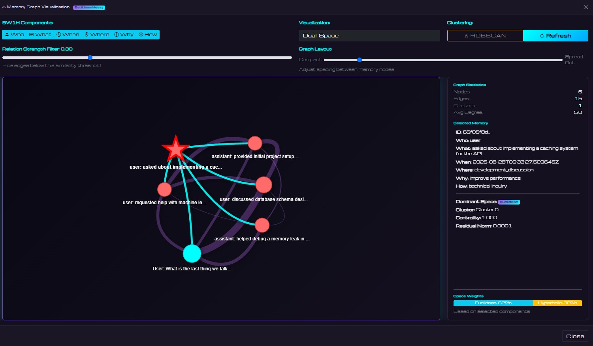

# [DSAM] Dual-Space Agentic Memory

> [!CAUTION]
> DSAM is currently pre-release, functionality might be broken while the app is prepared for release

DSAM is a high-performance adaptive memory system for AI agents featuring dual-space encoding (Euclidean + Hyperbolic), multi-dimensional merging, adaptive residual learning, provenance tracking, event deduplication with raw event preservation, similarity caching, and dynamic visualization.

## Overview

DSAM is a content-addressable memory system that operates on dual geometric manifolds. Unlike traditional memory systems that require explicit addresses, DSAM retrieves memories based on semantic similarity of their content. The architecture combines Euclidean space for concrete/lexical similarity with Hyperbolic space for abstract/hierarchical relationships, featuring immutable anchor embeddings with bounded residual adaptation that enable memories to evolve while maintaining stable representations.



## Core Architecture

### Dual-Space Encoding
- **Euclidean Space** (768-dim): Direct semantic embeddings from all-MiniLM-L6-v2 for concrete information
- **Hyperbolic Space** (64-dim): Models hierarchical relationships using Poincaré ball geometry with numerical stability
- **Field-Aware Composition**: Learned gates weight contributions from 5W1H fields
- **Product Distance Metrics**: Query-dependent weighting between spaces (λ_E + λ_H = 1.0)
- **Real-time Space Weight Calculation**: Dynamically calculated and persisted weights based on embedding properties

### Content-Addressable Memory
- **Semantic Retrieval**: Query with partial content, retrieve by meaning not location
- **Dual-Space Matching**: Content similarity computed in both Euclidean and Hyperbolic spaces
- **Structured Queries**: Use any combination of 5W1H fields for precise content matching
- **No Explicit Addresses**: Memories accessed purely through content similarity
- **Adaptive Similarity**: Frequently co-retrieved memories gravitate together in embedding space

### Adaptive Memory
- **Immutable Anchors**: Base embeddings preserved without corruption
- **Scale-Aware Residual Bounds**: Dynamic bounds based on anchor norms (Euclidean ≤ 0.35, Hyperbolic ≤ 0.75)
- **Field-Level Adaptation Limits**: Configurable per-field limits (e.g., 'who' limited to 0.2)
- **Momentum-Based Updates**: Smooth adaptation with configurable momentum (0.9) and decay factor (0.995)
- **HDBSCAN Clustering**: Density-based clustering with configurable parameters (min_cluster_size, min_samples)
- **Provenance Tracking**: Version history, residual norms, co-retrieval partners, and access patterns
- **Similarity Cache**: Pre-computed pairwise similarities with O(1) lookup performance

### Multi-Dimensional Merging & Event Deduplication
- **Multi-Dimensional Merge Groups**: Events organized across multiple dimensions:
  - **Actor Merging**: Groups events by participant (who)
  - **Temporal Merging**: Groups events by conversation threads
  - **Conceptual Merging**: Groups events by concepts and goals
  - **Spatial Merging**: Groups events by location context
- **Automatic Deduplication**: Similar events (similarity > 0.85) are merged to prevent redundancy
- **Raw Event Storage**: All original events are preserved and linked to their merged representations
- **Dual View Interface**: Toggle between merged events (deduplicated) and raw events (all originals)
- **Merge Group Tracking**: Visualize which raw events have been merged together across dimensions
- **Bidirectional Mapping**: Navigate from merged events to raw events and vice versa

### Performance Optimization
- **Similarity Cache**: Pre-computed pairwise similarities eliminate redundant calculations
- **Batch Processing**: Efficient bulk operations for dataset generation and storage
- **Parallel Generation**: Multi-threaded conversation generation for benchmarking
- **Sparse Storage**: Only similarities above threshold (0.2) are cached
- **Persistent Cache**: Similarity scores survive application restarts

### 5W1H Journal Framework
Complete context encoding for each memory:
- **Who**: Entity or actor involved
- **What**: Action, observation, or content
- **When**: Temporal information
- **Where**: Location or context
- **Why**: Purpose, reasoning, or intent
- **How**: Method, approach, or process

## Installation

```bash
# Clone repository
git clone https://github.com/jwest33/dsam_model_memory
cd agent-wip

# Run automated setup script
python setup_venv.py

# Windows activate virtual environment
.venv\Scripts\activate

# Linux/MacOS activate virtual environment
source .venv/bin/activate
```

### Environment Configuration

The system uses a `.env` file for configuration. Key settings:

```bash
# Set offline mode (recommended)
HF_HUB_OFFLINE=1
TRANSFORMERS_OFFLINE=1

# Optional: Custom paths
CHROMADB_PATH=./state/chromadb
BENCHMARK_DATASETS_PATH=./benchmark_datasets

# Optional: Flask settings
FLASK_PORT=5000
```

### Troubleshooting Installation

#### PyTorch Installation Issues
If you encounter issues with PyTorch:
```bash
# CPU-only version (smaller, faster install)
pip install torch --index-url https://download.pytorch.org/whl/cpu

# CUDA 11.8 (for NVIDIA GPUs)
pip install torch --index-url https://download.pytorch.org/whl/cu118
```

#### HuggingFace Model Downloads
If models fail to download:
1. Ensure you have internet connection for first-time setup
2. After initial download, use offline mode via `.env` file
3. Models are cached in `~/.cache/huggingface/`

#### ChromaDB Issues
If ChromaDB fails to install:
```bash
# Install build tools first
# Windows: Install Visual Studio Build Tools
# Linux: sudo apt-get install build-essential
# MacOS: xcode-select --install

# Then retry
pip install chromadb
```

## Quick Start

### Run the Web Interface

```bash
# Windows activate virtual environment
.venv\Scripts\activate

# Linux/MacOS activate virtual environment
source .venv/bin/activate

# Make sure LLM server is running first
python llama_server_client.py start

# Launch enhanced web interface
python run_web.py

# Access at http://localhost:5000
```

The web interface provides:
- Interactive chat with real-time space weight visualization
- Memory management with full 5W1H display and calculated space weights
- Multi-dimensional merge groups (Actor, Temporal, Conceptual, Spatial)
- Dual view modes: Merged (deduplicated) and Raw (all events)
- Graph visualization with adjustable layout controls
- Analytics dashboard with residual tracking
- Provenance information for each memory
- Merge group visualization showing relationships across dimensions

### Generate Dataset

```bash
<<<<<<< HEAD
# Dataset generation 
=======
# Standard dataset generation (sequential)
python benchmark\generate_benchmark_dataset.py

# Fast dataset generation (batched and parallel, 4-8x faster)
>>>>>>> 592e91b67bc5d7e9207c23ad123f482137168f02
python benchmark\generate_benchmark_dataset_fast.py
# Options: Small (100), Medium (500), Large (1000), Extra Large (2000), Massive (5000)

# Test similarity cache performance
python benchmark_similarity_performance.py
```

## Web Interface Features

### Chat Interface
- Real-time space weight visualization (Euclidean vs Hyperbolic)
- Query type detection (concrete/abstract/balanced)
- Memory usage indicators with provenance data
- Context-aware responses

### Memory Management
- Full 5W1H field display with all metadata
- Real-time calculated space weights (Euclidean/Hyperbolic percentages)
- Multi-dimensional merge dimensions:
  - **Actor**: Groups by participants
  - **Temporal**: Groups by conversation threads
  - **Conceptual**: Groups by concepts/goals
  - **Spatial**: Groups by location context
- Dual view modes:
  - **Merged View**: Deduplicated events with merge indicators
  - **Raw View**: All original events with merge group information
- Unified component table display with aligned columns
- Provenance tracking (version, access count, co-retrieval partners)
- Residual norm visualization
- Field-specific adaptation limits
- Individual memory graph view
- Batch operations support
- Click-to-view memory details with actual space weight display
- Similarity cache statistics and hit rate monitoring

### Graph Visualization
- **Interactive Network Graph**: Powered by vis.js
- **Multi-Dimensional Support**: Visualize merge groups from any dimension
- **Individual Memory Focus**: View a memory and its related connections
- **Adjustable Layout**: Graph spacing control slider for optimal viewing
- **Graph Statistics**: Nodes, edges, clusters, average degree
- **Color-Coded Nodes**: Different colors for users, assistants, and memory types

### Analytics Dashboard
- Total events and queries metrics
- Average residual norms by space
- Residual evolution time series
- Space usage distribution chart
- Real-time updates

## API Endpoints

### Core Endpoints
- `POST /api/chat`: Send chat messages with space weight calculation
- `GET /api/memories`: Retrieve all memories with metadata (supports `?view=raw` or `?view=merged`)
- `POST /api/memories`: Create new memory
- `DELETE /api/memories/<id>`: Delete specific memory
- `GET /api/memory/<id>/raw`: Get raw events for a merged memory
- `POST /api/graph`: Get memory graph data with optional center node
- `POST /api/search`: Search memories by query
- `GET /api/stats`: Get system statistics
- `GET /api/analytics`: Get analytics data for charts
- `GET /api/merge-stats`: Get merge group statistics
- `GET /api/merge-dimensions`: Get available merge dimensions
- `GET /api/merge-groups/<type>`: Get merge groups by dimension type
- `GET /api/multi-merge/<type>/<id>/details`: Get details for multi-dimensional merge group

## System Architecture

### Memory Store (`memory/memory_store.py`)
- Dual-space encoding integration with real-time weight calculation
- Event deduplication with raw event preservation
- Bidirectional raw-to-merged event mapping
- Residual and momentum tracking with scale-aware bounds
- HDBSCAN clustering with configurable parameters
- Field-level adaptation limits
- Forgetting mechanism for drift hygiene
- ChromaDB backend interface with multiple collections (events, raw_events, blocks)

### Dual-Space Encoder (`memory/dual_space_encoder.py`)
- Sentence transformer for base embeddings (all-mpnet-base-v2)
- Hyperbolic operations with numerical stability
  - Norm clipping to prevent boundary issues
  - Safe exp/log maps with epsilon stabilization
  - Möbius addition with automatic retraction
- Field-aware gating mechanism
- Query weight computation (λ_E, λ_H)

### ChromaDB Storage (`memory/chromadb_store.py`)
- Persistent vector storage
- Full 5W1H metadata preservation
- Provenance tracking (version, residual norms, co-retrieval partners)
- Efficient similarity search
- Unlimited capacity scaling

## Content-Addressable Memory in Action

### How It Works
```python
# Store memories without addresses - content IS the address
memory_agent.remember(
    who="Alice",
    what="implemented caching system",
    how="Redis with LRU eviction"
)

# Retrieve by partial content - no memory ID needed
results = memory_agent.recall(
    what="caching",  # Partial content match
    k=5
)
# Returns memories semantically similar to "caching"

# Multi-field content queries
results = memory_agent.recall(
    who="Alice",
    what="system",
    k=10
)
# Finds memories matching both fields semantically
```

### Content Addressing Features
- **No Memory IDs**: Content embeddings serve as implicit addresses
- **Semantic Matching**: Retrieves based on meaning, not exact string match
- **Partial Recall**: Query with fragments, retrieve complete memories
- **Cross-Field Search**: Any combination of 5W1H fields acts as content key
- **Similarity Ranking**: Results ordered by semantic distance in dual-space

## Key Innovations

### Enhanced Content-Addressable Architecture
DSAM extends traditional content-addressable memory with geometric intelligence:
- **Dual-Manifold Content Matching**: Simultaneous similarity search in Euclidean and Hyperbolic spaces
- **Semantic Address-Free Retrieval**: No memory pointers or indices - pure content-based access
- **Partial Content Queries**: Retrieve complete memories from fragments of information
- **Compositional Content Addressing**: Combine multiple 5W1H fields for precise matching

### Query-Adaptive Retrieval
- Dynamic space weighting based on query content type
- Concrete queries (code, errors) favor Euclidean space for lexical similarity
- Abstract queries (concepts, philosophy) favor Hyperbolic space for hierarchical relationships
- Balanced queries use both spaces equally
- Content determines retrieval geometry automatically

### Performance Optimizations
- **Similarity Cache**: Pre-computed pairwise similarities with O(1) lookup
- **Batch Processing**: Efficient bulk operations for memory storage
- **Parallel Generation**: Multi-threaded dataset creation (4-8x speedup)
- **Sparse Storage**: Only significant similarities cached (threshold: 0.2)
- **Persistent Cache**: Survives application restarts

### Residual Adaptation
- Memories adapt based on co-retrieval patterns
- Bounded updates prevent representation drift
- Momentum smoothing for stable learning
- Automatic decay over time

### Visual Analytics
- Space usage indicators throughout UI
- Real-time residual tracking
- Interactive graph exploration
- Component-based filtering
- Similarity cache statistics

## Configuration

Key settings in `config.py`:

```python
MemoryConfig:
  embedding_dim: 768  # Legacy dimension (kept for compatibility)
  temperature: 15.0
  similarity_threshold: 0.85

DualSpaceConfig:
  euclidean_dim: 768  # Dimension for Euclidean space
  hyperbolic_dim: 64  # Dimension for hyperbolic space
  learning_rate: 0.01
  momentum: 0.9
  euclidean_bound: 0.35  # Max residual norm for Euclidean
  hyperbolic_bound: 0.75  # Max residual norm for Hyperbolic
  use_relative_bounds: true  # Scale-aware bounds
  max_norm: 0.999  # Maximum norm in Poincaré ball
  epsilon: 1e-5  # Numerical stability epsilon
  decay_factor: 0.995
  min_residual_norm: 1e-6  # Minimum before zeroing
  hdbscan_min_cluster_size: 5
  hdbscan_min_samples: 3
  field_adaptation_limits:  # Per-field limits
    who: 0.2
    when: 0.3
    what: 0.5
    where: 0.4
    why: 0.5
    how: 0.5
  enable_forgetting: true

StorageConfig:
  chromadb_path: "./state/chromadb"
  chromadb_required: true
```

## Performance Characteristics

- **Graph Visualization**: Optimized for up to 200 nodes
- **HDBSCAN Clustering**: Best with 20+ memories, configurable parameters
- **Real-time Updates**: Sub-second for < 1000 memories
- **Residual Bounds**: Scale-aware with configurable limits
- **Hyperbolic Stability**: Automatic norm clipping at 0.999
- **Provenance Tracking**: Maintains full history without performance impact

## Troubleshooting

### Common Issues

**HuggingFace Rate Limiting**
```bash
export HF_HUB_OFFLINE=1
export TRANSFORMERS_OFFLINE=1
```

**ChromaDB Locked**
```bash
# Stop web server before clearing
python clear_memories.py
```

**High Residuals**
- System automatically decays residuals (factor 0.995)
- Monitor via Analytics dashboard
- Field-level limits prevent excessive adaptation
- Use forgetting mechanism to reset specific memories
- Consider clearing if consistently > bounds

## License

[MIT License](LICENSE)

## TODO:
  * Update chat interface to get merge groups instead of raw
  * Memory block graph terminal context vectors/pointers
  * Consolidate data model modules
