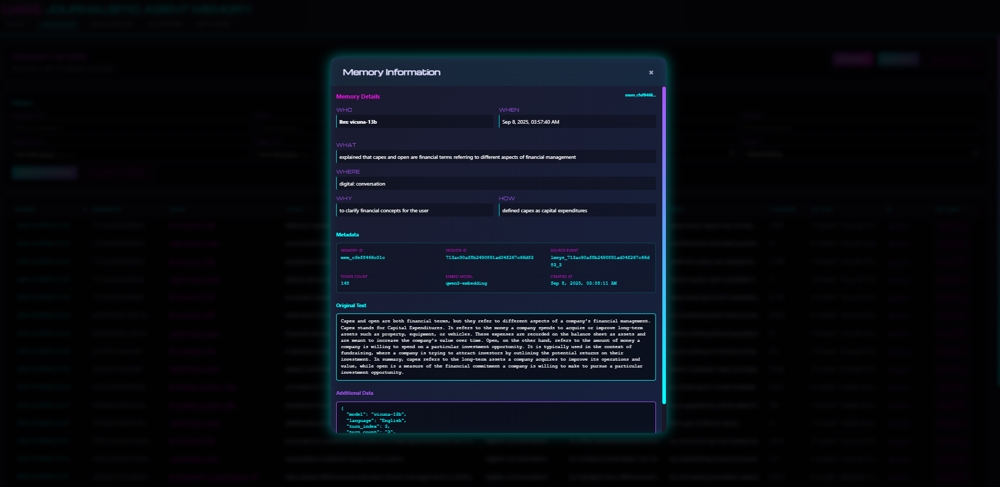
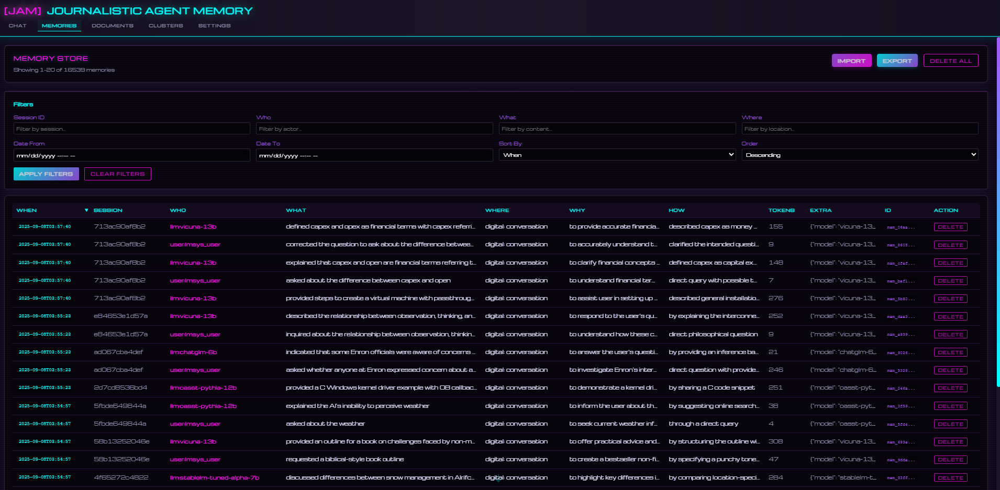
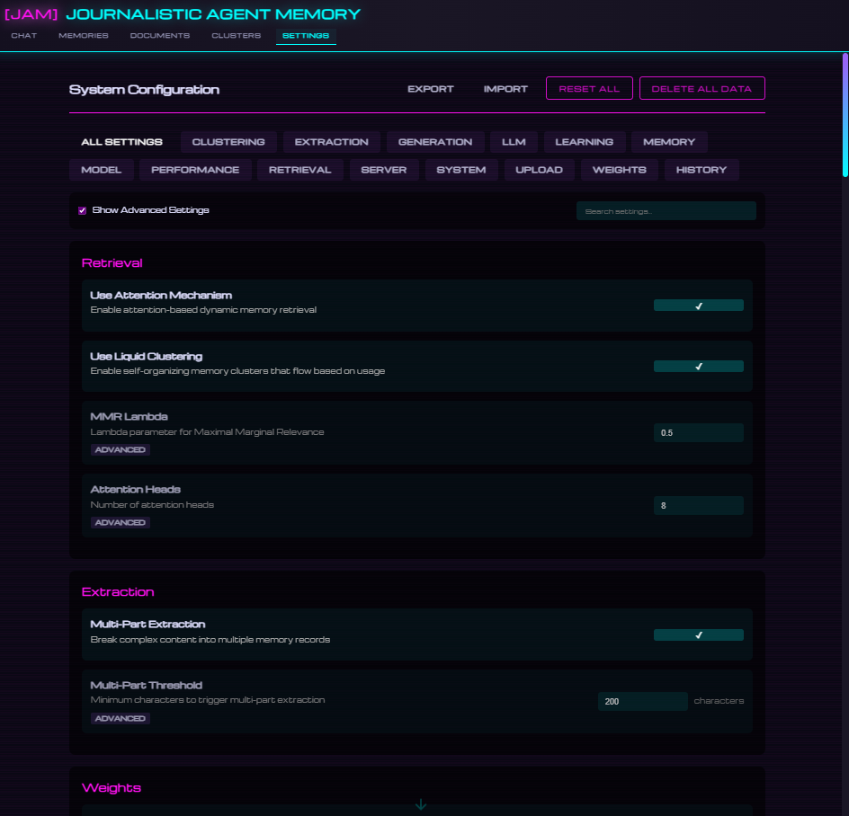
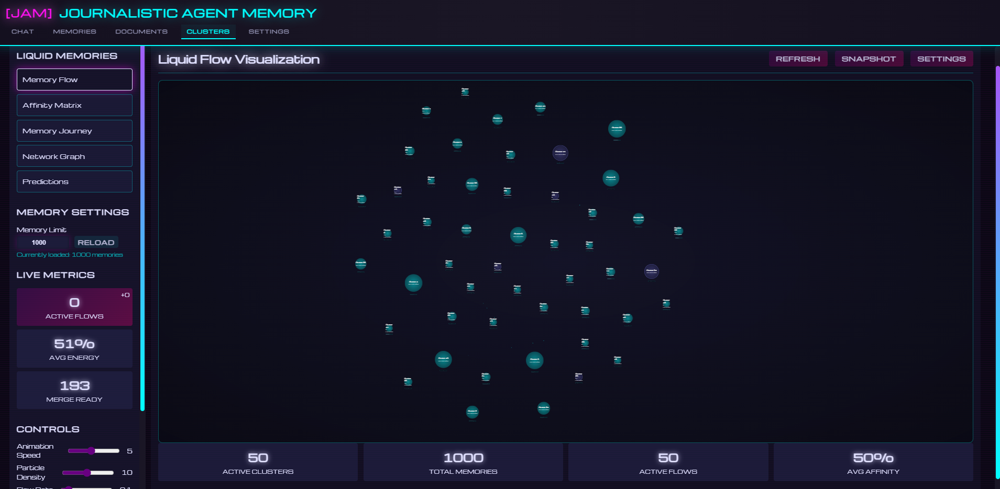
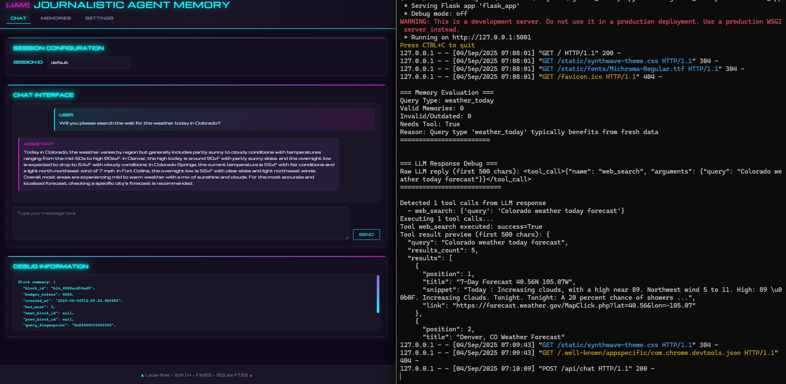

# JAM - Journalistic Agent Memory

> Give your AI assistant a memory that actually remembers

JAM is a local-first memory system that gives AI assistants human-like memory capabilities. Every conversation, tool use, and interaction becomes a searchable memory that your AI can recall and build upon. Think of it as giving your AI assistant a journal that it actually reads and learns from.

## 🎯 What It Does

JAM transforms AI assistants from goldfish (forgetting everything after each conversation) into elephants (remembering everything that matters). It runs entirely on your computer, keeping your data private while giving your AI:

- **Persistent Memory**: Your AI remembers past conversations, decisions, and context across sessions
- **Smart Recall**: Finds relevant memories using multiple strategies - not just keyword matching
- **Self-Organization**: Memories naturally cluster by topic, time, and importance
- **Tool Memory**: Learns from past web searches, API calls, and tool usage

## 🚀 Quick Start

### Prerequisites
- Python 3.11 or newer
- 8GB+ RAM recommended
- A local LLM model (we recommend Qwen-4B in GGUF format)

### Installation

```bash
# Clone the repository
git clone https://github.com/jwest33/jam_model_memory.git
cd jam_model_memory

# Install dependencies
pip install -r requirements.txt

# Start everything with one command
python -m agentic_memory.cli server start --all --daemon

# Open the web interface
# Navigate to: http://localhost:5001
```

That's it! The system will start all necessary services and open a web interface where you can chat with your memory-enhanced AI.

## 📸 Screenshots

### Chat Interface
The main interface where you interact with your AI assistant. Notice how it recalls relevant past conversations and builds on previous context:



### Memory Explorer
Browse through all stored memories, see how they're categorized, and understand what your AI remembers:



### Settings Panel
Configure how your AI's memory works - adjust search strategies, memory retention, and more:



### Memory Visualization
Watch your AI's memory organize itself in real-time with our 3D cluster visualization:



## 🧠 How It Works

JAM uses a journalistic approach to memory - every event is broken down into the fundamental questions: Who, What, When, Where, Why, and How. This allows the AI to:

1. **Understand Context**: "Who was involved in that conversation about the budget last Tuesday?"
2. **Track Patterns**: "What approaches have we tried for this problem before?"
3. **Learn from Experience**: "How did we solve this issue last time?"
4. **Maintain Continuity**: "Why did we decide to go with that approach?"

### The Magic Behind the Scenes

When you interact with JAM:

1. **Capture**: Every message, response, and tool use is captured
2. **Extract**: A local AI extracts the key information (Who, What, When, Where, Why, How)
3. **Index**: The memory is stored and indexed for fast retrieval
4. **Retrieve**: When needed, relevant memories are found using multiple search strategies
5. **Apply**: The AI uses these memories to provide context-aware responses

## 🔧 Configuration

JAM works out of the box with sensible defaults, but you can customize it through:

### Web Interface
Visit `http://localhost:5001/config` to adjust settings in real-time

### Environment Variables
Create a `.env` file for persistent configuration:

```bash
# Essential Settings
AM_MODEL_PATH=/path/to/your/model.gguf  # Path to your LLM model
AM_DB_PATH=./memories.db                # Where to store memories

# Optional Tuning
AM_CONTEXT_WINDOW=8192                  # How much context the AI can use
AM_USE_LIQUID_CLUSTERS=true            # Enable self-organizing memory
AM_USE_ATTENTION=true                   # Track which memories are used
```

## 🛠️ Advanced Features

### Command Line Interface
Control everything from the terminal:

```bash
# Server management
python -m agentic_memory.cli server status     # Check what's running
python -m agentic_memory.cli server restart    # Restart all services

# Memory operations
python -m agentic_memory.cli memory add "Remember this important note"
python -m agentic_memory.cli memory search "that meeting last week"
python -m agentic_memory.cli memory stats      # See memory statistics
```

### API Access
JAM provides an OpenAI-compatible API for integration with other tools:

```python
import requests

response = requests.post("http://localhost:8001/v1/chat/completions",
    json={
        "messages": [{"role": "user", "content": "What did we discuss yesterday?"}],
        "model": "local"
    }
)
```

### Memory Visualization
The 3D visualization shows how memories cluster and relate:
- **Clusters**: Similar memories group together automatically
- **Colors**: Indicate recency, usage frequency, or topic
- **Movement**: Watch memories reorganize as you use them
- **Exploration**: Click and drag to explore your memory landscape

## 🎨 Features

### Smart Memory Retrieval
- **Semantic Search**: Finds memories by meaning, not just keywords
- **Temporal Awareness**: Prioritizes recent and relevant memories
- **Pattern Recognition**: Identifies related memories across time
- **Context Building**: Optimally packs memories for AI context windows

### Privacy & Control
- **100% Local**: Everything runs on your computer
- **No Cloud Dependencies**: Your data never leaves your machine
- **Export/Import**: Take your memories with you
- **Selective Forgetting**: Remove memories you don't want kept

### Tool Integration
JAM remembers and learns from tool usage:



- Web searches and their results
- API calls and responses
- File operations and outcomes
- Custom tool executions

## 📚 Use Cases

### Personal Assistant
- Remembers your preferences, decisions, and context
- Tracks ongoing projects and their history
- Maintains conversation continuity across sessions

### Research Helper
- Keeps track of sources and findings
- Remembers previous searches and their results
- Builds knowledge over time

### Development Companion
- Remembers code decisions and architectural choices
- Tracks debugging sessions and solutions
- Maintains project context across coding sessions

### Creative Partner
- Remembers story elements and character details
- Tracks creative decisions and iterations
- Maintains narrative consistency

## 🤝 Contributing

We welcome contributions! Whether it's bug fixes, new features, or documentation improvements, please feel free to:

1. Fork the repository
2. Create a feature branch
3. Make your changes
4. Submit a pull request

## 📄 License

MIT License - see [LICENSE](LICENSE) for details

## 🙏 Acknowledgments

JAM builds on amazing open-source projects:
- [llama.cpp](https://github.com/ggerganov/llama.cpp) for local LLM inference
- [FAISS](https://github.com/facebookresearch/faiss) for vector similarity search
- [Sentence Transformers](https://www.sbert.net/) for embeddings
- The entire Python ecosystem that makes this possible

---

**Ready to give your AI a memory?** Get started with JAM today and transform your AI from a goldfish into an elephant! 🐘

*For technical details and architecture information, see [docs/TECHNICAL.md](docs/TECHNICAL.md)*